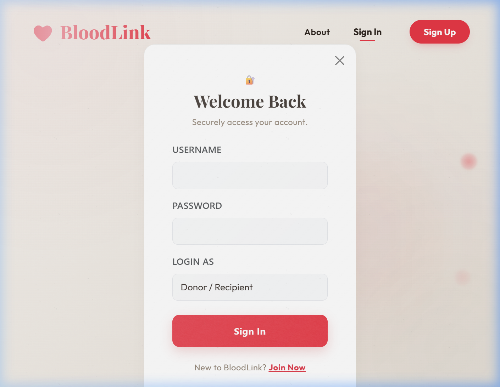
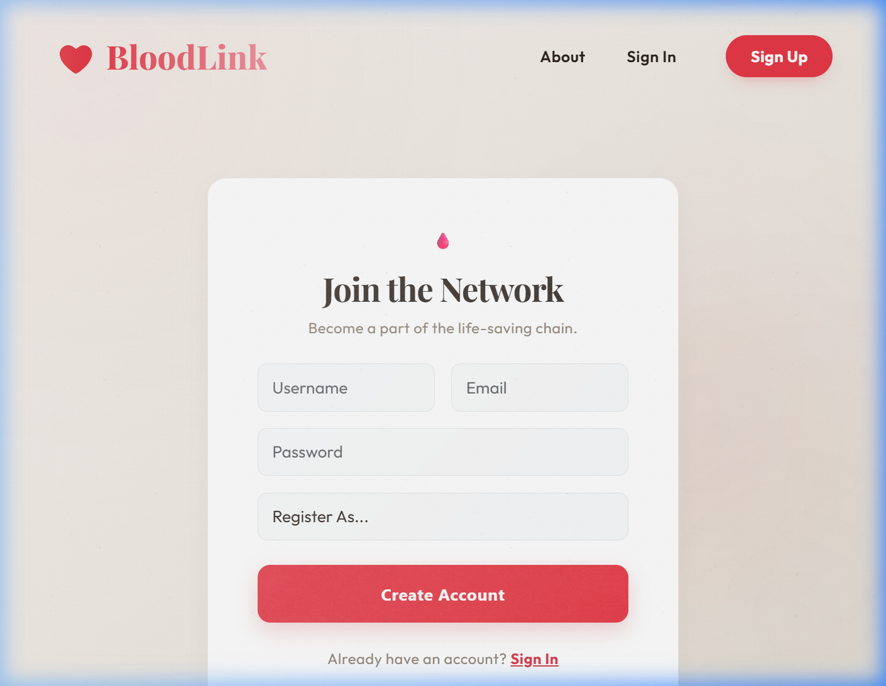
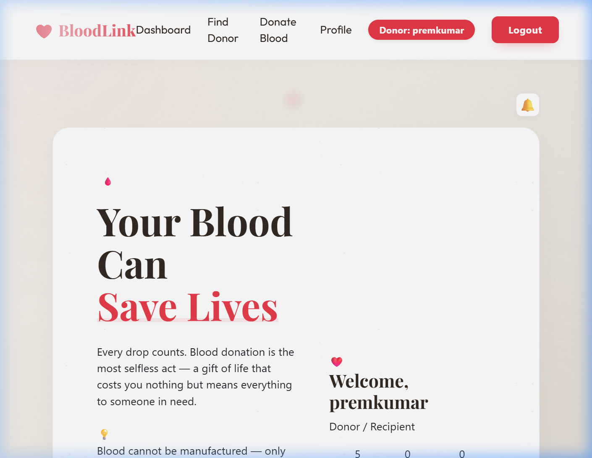
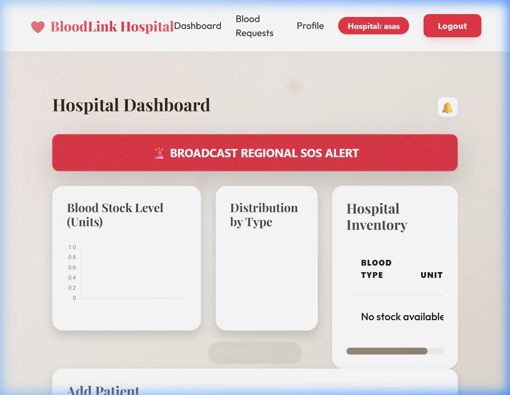
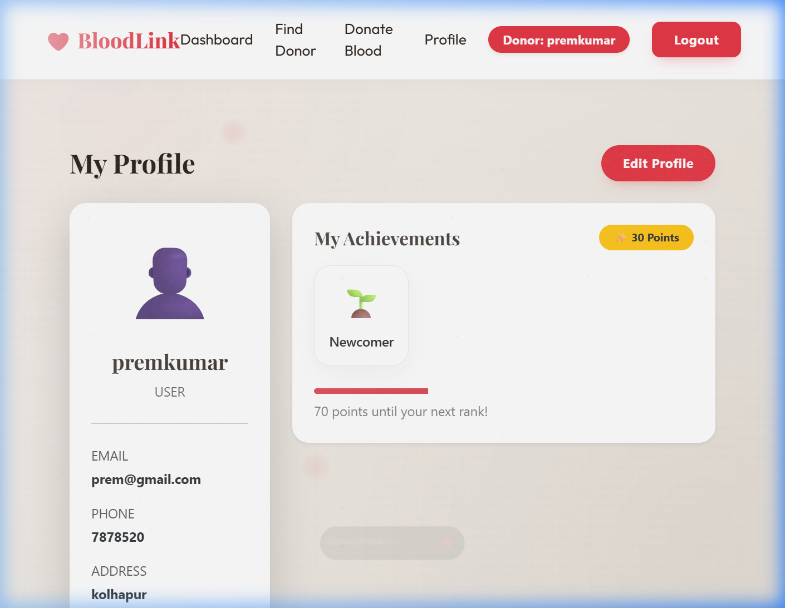

# 🩸 BloodLink | Advanced Blood Donation Management System

[](https://github.com/premkumarmali/Blood-Donation-System)
[](https://reactjs.org/)
[](https://spring.io/projects/spring-boot)
[](https://www.mysql.com/)

> **"Every Donor is a Superhero."**
> BloodLink is a full-stack platform designed to bridge the gap between blood donors, hospitals, and blood banks in real-time. Life-saving resources, just a click away.

---

## 📸 Screenshots

### 🎨 Authentication Experience
| Login Page | Register Page |
| :---: | :---: |
|  |  |

### 📊 Dashboards & Profiles
| Donor Dashboard | Hospital Inventory |
| :---: | :---: |
|  |  |

### 👤 Profile Management
| User Profile |
| :---: |
|  |

---

## ✨ Features

### 🏠 Home Blood Collection
- Donors can choose between **visiting a hospital/blood bank** or requesting **home collection** when booking a donation appointment.
- If home collection is selected, donors provide their full address — which is displayed to hospital/blood bank staff on their dashboard.
- Appointment tables show a clear badge: 🏠 **Home** or 🏥 **Hospital** for quick staff reference.

### 🔔 Real-Time Emergency Notification System
- Any user or hospital can **broadcast an Emergency SOS** with a single button click.
- The alert is delivered system-wide and visible to all logged-in users and admins instantly.
- Each emergency notification includes the sender's **Name**, **Contact Number**, and **Location** for immediate action.
- A 🔔 notification bell on every dashboard shows the **unread alert count** and a dropdown panel with full emergency details.
- Notifications auto-refresh every 10 seconds and show toast popups for new incoming alerts.

### 📅 Donation Appointment Scheduling
- Donors can book time-slotted appointments at any registered hospital or blood bank.
- Options for blood type, preferred date, time slot, and collection method (Home / Hospital visit).
- Full appointment history with live status: **Pending → Approved → Completed**.

### 🩸 Blood Request System
- Donors and hospitals can submit blood requests specifying blood group and units required.
- Blood Bank admins can approve or reject requests directly from their dashboard.
- Stock is automatically deducted from inventory when a request is approved.
- Hospitals can mark requests as **Emergency Priority** for faster processing.

### 🚚 Blood Delivery Tracking
- Approved blood requests automatically generate delivery records.
- Delivery status tracking: **Pending → Out for Delivery → Delivered**.
- Dedicated delivery management interface for blood bank managers.

### 📦 Blood Inventory Management
- Real-time blood stock tracking by type (A+, A-, B+, B-, AB+, AB-, O+, O-) per location.
- Blood bank staff can add new stock directly from the dashboard.
- Visual analytics charts for inventory levels across facilities.

### 🚨 Regional SOS Alert (Hospitals)
- Hospitals can broadcast a **Regional Emergency SOS** to notify all users and admins of critical blood shortages.
- A dedicated SOS banner appears on all dashboards when active emergency requests exist.
- SOS alerts display blood group, required units, and the requesting hospital name.

### 🏆 Donor Gamification
- Donors earn **reward points** for each completed blood donation.
- **Badge progression** system: Newcomer → Regular Donor → Hero → Legend.
- Points and badges are displayed on the donor's personal dashboard.

### 👥 Role-Based Dashboards
| Role | Capabilities |
|------|-------------|
| **Donor / Recipient** | Book appointments, request blood, earn points & badges, broadcast SOS, track request status |
| **Hospital** | Manage patients, raise blood requests, mark emergency priority, view donor appointments with collection type |
| **Blood Bank Admin** | Manage inventory, approve/reject requests, track deliveries, view analytics |

### 🗺️ Nearby Blood Camps Map
- Integrated Google Maps showing nearby blood donation camps and banks.
- Available on both donor and hospital dashboards.

### 🎨 Premium UI/UX Design
- Dark-themed glassmorphism interface with high-contrast accents.
- Smooth animations, scroll-reveal effects, and hover micro-interactions.
- Fully responsive across Desktop, Tablet, and Mobile screens.
- Dynamic theme support with custom CSS design tokens.

---

## 🛠️ Technology Stack

### Frontend
- **Framework**: React.js 18
- **Styling**: Vanilla CSS3 (Custom Design System), Bootstrap 5
- **Fonts**: Google Fonts — Outfit
- **State Management**: React Hooks
- **Routing**: React Router v6
- **Notifications**: React Toastify

### Backend
- **Framework**: Spring Boot 3.x
- **Language**: Java 17
- **Database**: MySQL 8.0
- **ORM**: Spring Data JPA / Hibernate
- **Security**: Custom Role-Based Access Control

---

## 🏗️ Project Structure

```
Blood-Donation-System/
├── blooddonation/                        # Spring Boot Backend
│   └── src/main/java/com/blooddonation/
│       ├── controller/                   # REST API Controllers
│       │   ├── UserController.java
│       │   ├── DonationAppointmentController.java
│       │   ├── OrdersController.java
│       │   ├── NotificationController.java
│       │   ├── StorageController.java
│       │   └── DeliveriesController.java
│       ├── model/                        # JPA Entity Models
│       │   ├── User.java
│       │   ├── DonationAppointment.java
│       │   ├── Orders.java
│       │   ├── Notification.java
│       │   ├── Storage.java
│       │   └── Deliveries.java
│       └── repository/                   # Spring Data Repositories
│
└── blooddonation/Frontend/               # React Frontend
    └── blood-donation-frontend/src/
        ├── components/
        │   ├── NotificationSystem.js     # Real-time notification bell
        │   ├── Sidebar.js
        │   ├── InventoryAnalytics.js
        │   └── BadgeSystem.js
        ├── pages/
        │   ├── Dashboard.js              # Donor/User dashboard
        │   ├── AdminDashboard.js         # Blood Bank Admin dashboard
        │   ├── HospitalDashboard.js      # Hospital dashboard
        │   ├── DonateBlood.js            # Appointment booking with home/hospital option
        │   ├── Orders.js
        │   ├── Deliveries.js
        │   ├── Login.js
        │   └── Register.js
        └── index.css                     # Global design system & theme tokens
```

---

## 🚦 Getting Started

### Prerequisites
- Java JDK 17+
- Node.js & npm
- MySQL Server

### 1. Database Setup
Create a MySQL database named `blood_donation_db` and update `src/main/resources/application.properties`:
```properties
spring.datasource.url=jdbc:mysql://localhost:3306/blood_donation_db
spring.datasource.username=YOUR_USERNAME
spring.datasource.password=YOUR_PASSWORD
spring.jpa.hibernate.ddl-auto=update
```

### 2. Run Backend
```bash
cd blooddonation
./mvnw spring-boot:run
```
Backend runs at: `http://localhost:8080`

### 3. Run Frontend
```bash
cd blooddonation/Frontend/blood-donation-frontend
npm install
npm start
```
Frontend runs at: `http://localhost:3000`

---

## 🛡️ Security & Reliability
- **Role-Based Access Control**: Each user role sees only their relevant data and actions.
- **Data Integrity**: Database constraints and backend validation on all critical operations.
- **Null Safety**: All API endpoints include null-safety guards.
- **Stock Validation**: Blood requests are blocked if insufficient stock is available.

---

## 📄 License
This project is licensed under the MIT License.

---

<p align="center">
  Made with ❤️ for saving lives — BloodLink
</p>
